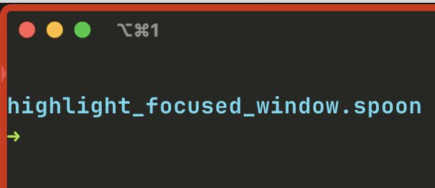

# HighlightFocusedWindow Spoon

`HighlightFocusedWindow` is a Hammerspoon spoon that visually highlights the currently focused window by drawing a customizable border around it. The border updates automatically when the window focus changes, or when the window is moved, minimized, or destroyed.



## Features

- **Customizable Border**: Modify the color, width, and appearance of the focus border.
- **Auto-updating**: Automatically updates the border on window focus changes, movements, minimization, or destruction.
- **Lightweight**: Efficient and minimal, focusing only on the task of highlighting the active window.

## Requirements

- [Hammerspoon](https://www.hammerspoon.org) installed on macOS.

## Installation

1. **Download and Install Hammerspoon**: If you haven't already, download and install Hammerspoon from [hammerspoon.org](https://www.hammerspoon.org).

2. **Save the Spoon**:
   - Ensure the files are located in `~/.hammerspoon/Spoons/highlight_focused_window.spoon/`.

3. **Load and Enable the Spoon**:
   - In your Hammerspoon `init.lua` (`~/.hammerspoon/init.lua`), load and enable the spoon:

     ```lua
     hs.loadSpoon("highlight_focused_window")
     spoon.HighlightFocusedWindow:enable()
     ```

## Configuration

The border's appearance can be customized by modifying the following variables within the `init.lua` script:

- `borderColor`: Defines the color and opacity of the border. The default is red with 80% opacity.
- `borderWidth`: The width of the border in pixels. The default is 10 pixels.
- `borderPadding`: Extra padding around the window. The default is 0.
- `borderRadius`: The radius of the border corners. The default is 8.

Example of customizing these settings (within the spoon's `init.lua`):

```lua
local borderColor = {red=0, green=1, blue=0, alpha=0.8}  -- Green border
local borderWidth = 10  -- 10 pixels wide
local borderRadius = 12 -- More rounded corners
```
